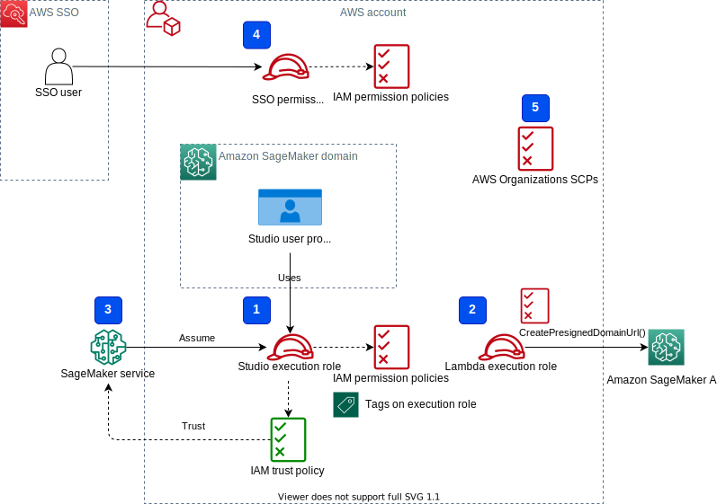

# Team and user management with Amazon SageMaker and SSO

## Solution overview


### Network infrastructure
This solution provisions all required network infrastructure. The CloudFormation template `./cfn-templates/vpc.yaml` contains the source code.


### IAM Roles



The stack creates three SageMaker execution roles used in the SageMaker domain:
- `SageMakerDefaultExecutionRole`
- `SageMakerTeam1ExecutionRole`
- `SageMakerTeam2ExecutionRole`

Please note, no one of the roles has [`AmazonSageMakerFullAccess`](https://docs.aws.amazon.com/sagemaker/latest/dg/security-iam-awsmanpol.html) policy attached. In your real life SageMaker environment you need to amend role's permissions based on your specific requirements.

`SageMakerDefaultExecutionRole` has only a custom policy `SageMakerReadOnlyPolicy` attached with a restrictive list of allowed actions. 

The both team roles, `SageMakerTeam1ExecutionRole` and `SageMakerTeam2ExecutionRole` have additionally two custom polices `SageMakerAccessSupportingServicesPolicy` and `SageMakerStudioDeveloperAccessPolicy`.

The Studio developer access policy enforces the `Team` tag for calling any SageMaker `Create*` API. Furthermore, it allows using delete, stop, update, and start operations only on resources tagged with the same `Team` tag:
```json
{
    "Condition": {
        "ForAnyValue:StringEquals": {
            "aws:TagKeys": [
                "Team"
            ]
        },
        "StringEqualsIfExists": {
            "aws:RequestTag/Team": "${aws:PrincipalTag/Team}"
        }
    },
    "Action": [
        "sagemaker:Create*"
    ],
    "Resource": [
        "arn:aws:sagemaker:*:<ACCOUNT_ID>:*"
    ],
    "Effect": "Allow",
    "Sid": "AmazonSageMakerCreate"
}
```

For more information on roles and polices, refer to the blog post [Configuring Amazon SageMaker Studio for teams and groups with complete resource isolation](https://aws.amazon.com/fr/blogs/machine-learning/configuring-amazon-sagemaker-studio-for-teams-and-groups-with-complete-resource-isolation/).

### Architecture overview

## Deployment

### Prerequisites
[AWS CLI](https://docs.aws.amazon.com/cli/latest/userguide/cli-chap-getting-started.html), [AWS SAM CLI](https://docs.aws.amazon.com/serverless-application-model/latest/developerguide/serverless-sam-cli-install.html) and [python3.8 or later](https://www.python.org/downloads/) must be installed.

The deployment procedure assumes that [AWS Single Sign On](https://docs.aws.amazon.com/singlesignon/latest/userguide/what-is.html) has been enabled and configured for the [AWS Organization](https://docs.aws.amazon.com/organizations/latest/userguide/orgs_introduction.html) where the solution will be deployed.

You can follow these [instructions](./aws-sso-setup.md) to setup AWS Single Sign On.

### Deploy solution CloudFormation stack
There are following network infrastructure deployment options:
- **New VPC**: the solution creates a new VPC with all subnets, one public and one private route tables, NAT and Internet gateways, security groups, and VPC endpoints.
- **Existing VPC**: you can use your **existing** VPC, a public subnet, and NAT and Internet gateways. No one of these resources are created by the solution in this option. If you use an existing VPC you can choose one of the following options:
    - **new private subnets**: the solution creates private subnets without internet access, a route table with a local route only, security groups, and VPC endpoints.
    - **use existing private subnets**: the solution creates security groups and VPC endpoints only.

To choose one of these deployment options, provide the following CloudFormation template parameters.

##### New VPC
- `VPCCIDR` (optional): CIDR block for a new VPC. Default is `10.0.0.0/16`
- `SAMLBackedPrivateSubnetCIDR` (optional): CIDR block for a private subnet for SAML backend. Default is `10.0.0.0/19`
- `SageMakerDomainPrivateSubnetCIDR` (optional):  CIDR block for a private subnet for SageMaker domain. Default is `10.0.32.0/19`
- `PublicSubnetCIDR` (optional): CIDR block for a public subnet for Internet and NAT Gateways. Default is `10.0.128.0/20`

❗ The provided VPC and subnet CIDR blocks must be compatible with your existing VPC and subnets. Refer to [VPC documentation](https://docs.aws.amazon.com/vpc/latest/userguide/configure-your-vpc.html#vpc-sizing-ipv4) on more details on CIDR block associations.

##### Existing VPC and new private subnets
- `ExistingVPCId` (required): Existing VPC id. You can list all VPC in your AWS account by running an AWS CLI command: 
    ```
    aws ec2 describe-vpcs
    ```
- `SAMLBackedPrivateSubnetCIDR` (required): CIDR block for a **new** private SAML backend subnet.
- `SageMakerDomainPrivateSubnetCIDR` (required): CIDR block for a **new** private subnet for SageMaker domain.

❗ The provided private subnet CIDR blocks must be compatible with your VPC and existing subnets. Refer to [VPC documentation](https://docs.aws.amazon.com/vpc/latest/userguide/configure-your-vpc.html#vpc-sizing-ipv4) on more details on CIDR block associations.
❗ The private subnets are created without internet access. The stack creates a route table with a local route only and associates this table with SAML backend and SageMaker private subnets. You must add a [route to a NAT gateway](https://docs.aws.amazon.com/vpc/latest/userguide/vpc-nat-gateway.html#nat-gateway-create-route) to the route table if you need an internet route for the private subnets. If you don't configure an internet route for a SageMaker private subnet, you won't have internet access in Studio notebooks.

##### Existing VPC and existing private subnets
- `ExistingVPCId` (required): Existing VPC id
- `SAMLBackedPrivateSubnetCIDR` (required): CIDR block for an **existing** subnet. The SAML backend will be created in this subnet.
- `SageMakerDomainPrivateSubnetCIDR` (required): CIDR block for an **existing** subnet for a SageMaker domain. To list all SageMaker domain subnets you can run the following AWS CLI commands:
    ```
    export DOMAIN_ID=$(aws sagemaker list-domains --output text --query 'Domains[0].DomainId')
    aws sagemaker describe-domain --domain-id $DOMAIN_ID --output text --query 'SubnetIds[*]'
    ```
❗ For this option you must use an existing SageMaker domain private subnet in the Availability Zone `a`, for example in `us-east-1a` for North Virginia AWS Region. The stack creates SageMaker API, Studio, and runtime VPC endpoints in the Availability Zone `a`.

### SageMaker domain

##### New domain

##### Existing domain
must be in `IAM` authentication mode

### Create SSO users

### Create 
## Test

# Resources
## Documentation
- [Attributes for access control](https://docs.aws.amazon.com/singlesignon/latest/userguide/attributesforaccesscontrol.html)

## Blog posts
- [Onboarding Amazon SageMaker Studio with AWS SSO and Okta Universal Directory](https://aws.amazon.com/fr/blogs/machine-learning/onboarding-amazon-sagemaker-studio-with-aws-sso-and-okta-universal-directory/)
- [Configuring Amazon SageMaker Studio for teams and groups with complete resource isolation](https://aws.amazon.com/fr/blogs/machine-learning/configuring-amazon-sagemaker-studio-for-teams-and-groups-with-complete-resource-isolation/)
- [Secure access to Amazon SageMaker Studio with AWS SSO and a SAML application](https://aws.amazon.com/blogs/machine-learning/secure-access-to-amazon-sagemaker-studio-with-aws-sso-and-a-saml-application/)

Copyright Amazon.com, Inc. or its affiliates. All Rights Reserved.
SPDX-License-Identifier: MIT-0