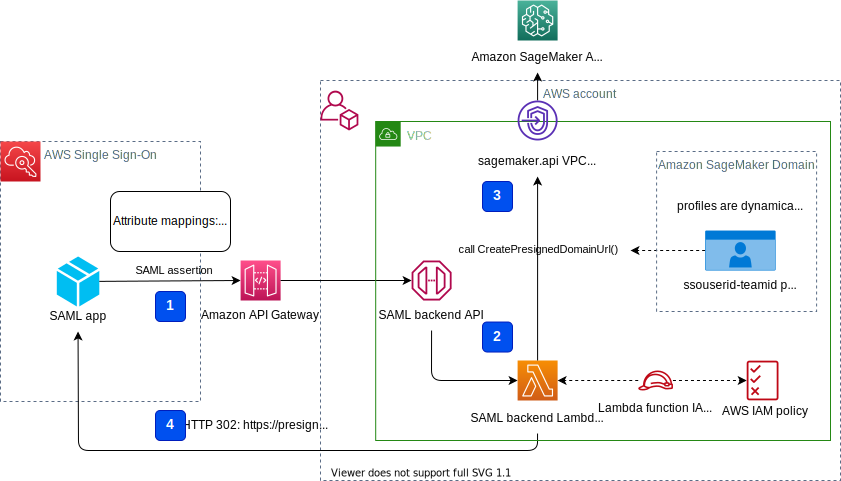
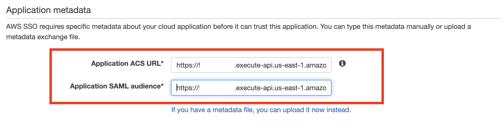
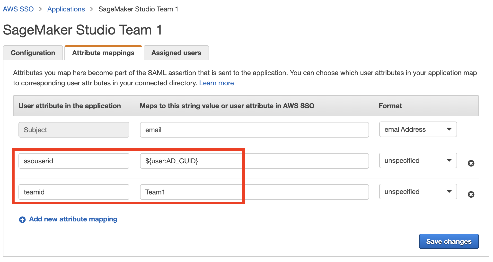
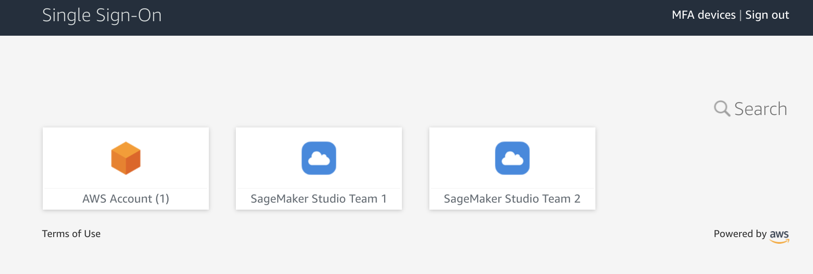
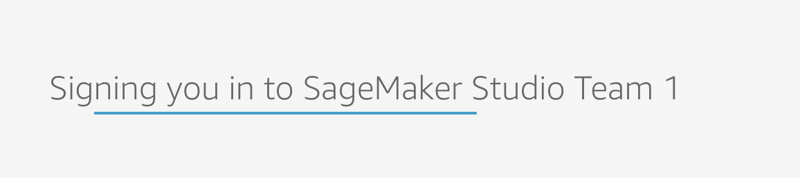
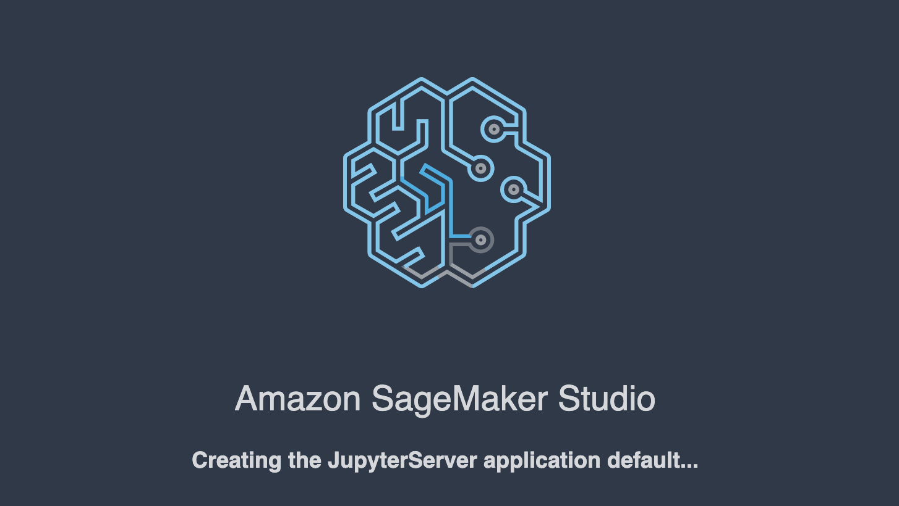
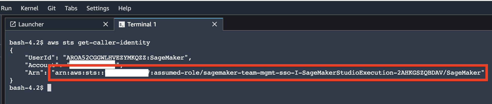
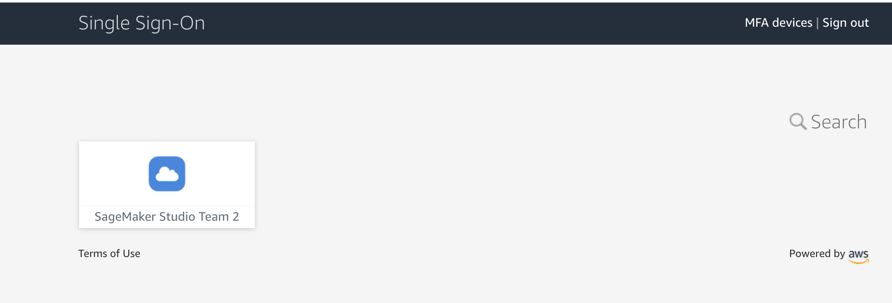
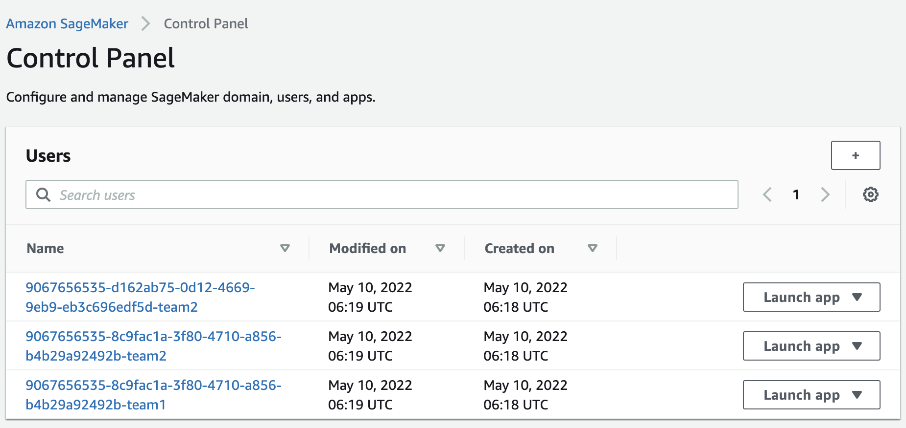

# Team and user management with Amazon SageMaker and AWS Single Sign-On

## Solution overview
[Amazon SageMaker Studio](https://docs.aws.amazon.com/sagemaker/latest/dg/studio-ui.html) is a web-based, integrated development environment (IDE) for machine learning (ML) that lets you build, train, debug, deploy, and monitor your ML models. Each on-boarded user in Studio has their own dedicated set of resources, such as compute instances, a home directory on an Amazon Elastic File System (EFS) volume, and a dedicated IAM execution role. 

One of the most common real-life challenges in setting up user access for Studio is how to manage multiple users, groups, and data science teams for data access and resource isolation.

Many customers implement user management using federated identities with [AWS Single Sign-On](https://docs.aws.amazon.com/singlesignon/latest/userguide/what-is.html) (SSO) and an external identity provider, such as Active Directory (AD) or AWS Managed Microsoft AD directory. It is aligned with AWS [best practice](https://wa.aws.amazon.com/wat.question.SEC_2.en.html) of using temporary credentials to access AWS accounts.

[Amazon SageMaker Domain](https://docs.aws.amazon.com/sagemaker/latest/dg/studio-entity-status.html) supports AWS SSO and can be configured in SSO [authentication mode](https://docs.aws.amazon.com/sagemaker/latest/dg/onboard-sso-users.html). In this case each entitled SSO user has their own [Studio user profile](https://docs.aws.amazon.com/sagemaker/latest/dg/studio-entity-status.html). Users given access to Studio have a unique sign-in URL that directly opens Studio, and they sign in with their SSO credentials. Organizations manage their users in AWS SSO instead of the SageMaker domain. You can assign multiple users access to the domain at the same time.

In SSO authentication mode, there is always **one-to-one** mapping between users and user profiles. This works well in the case when one user is a member of only one data science team. In a more common use case, when a user can participate in multiple ML projects and be member of multiple teams, the user requires access to different Studio user profiles with different execution roles and permission policies. Since you cannot manage user profiles independently of AWS SSO in SSO authentication mode, you cannot implement a one-to-many mapping between users and Studio user profiles.

The second challenge is this that [IAM-based access control](https://docs.aws.amazon.com/sagemaker/latest/dg/security_iam_id-based-policy-examples.html#api-access-policy) works only when the SageMaker domain is configured in IAM authentication mode; you can’t use it when the SageMaker domain is deployed in AWS SSO mode. 

This solution addresses a challenge of AWS SSO user management for Amazon SageMaker Studio for a common use case of multiple user groups and a many-to-many mapping between users and teams. The solution outlines how to use a [custom SAML 2.0 application](https://docs.aws.amazon.com/singlesignon/latest/userguide/samlapps.html#addconfigcustomapp) as the mechanism to trigger the user authentication for Studio and to support multiple Studio user profiles per one AWS SSO user.

## Architecture overview
The solution implements the following architecture:


The main high-level architecture components are:

**1 - Identity provider**  
Users and groups are managed in an external identity source, for example in Azure Active Directory. User assignments to AD groups define what permissions a particular user has and what SageMaker Studio "team" they have access to. The identity source must by synchronized with AWS SSO.

**2 - AWS Single Sign-On**  
AWS Single Sign-On service managed SSO users, SSO permission set, and applications. This solution uses custom SAML 2.0 application to provide access to Amazon SageMaker Studio for entitled SSO users. The solution also uses SAML attribute mapping to populate the SAML assertion with specific access-relevant data, such as SageMaker domain id, user id, and user team.

**3 - custom SAML 2.0 applications**  
The solution creates one application per SageMaker Studio team and assigns one or multiple applications to a user or a user group based on entitlements. Users can access these applications from within their SSO user portal based on assigned permissions. Each application is configured with the [Amazon API Gateway](https://aws.amazon.com/api-gateway/) endpoint URL as its SAML backend. 

**4 - Amazon SageMaker domain**  
The solution provisions a SageMaker domain in an AWS account and creates a dedicated user profile for each combination of SSO user and Studio team the user assigned to. The domain must be configured in IAM [authentication mode](https://docs.aws.amazon.com/sagemaker/latest/dg/onboard-iam.html).

**5 - Studio user profiles**  
You must provision a dedicated user profile for each _user-team_ combination For example, if a user is a member of two Studio teams and has corresponding permissions, you need to provision two separate user profiles for this user. Each profile always belongs to one and only one user.

To demonstrate the configuration, we use two users, _User 1_, _User 2_, and two Studio teams _Team 1_, _Team 2_. The _User 1_ belongs to both teams, while the _User 2_ belongs to _Team 2_ only. The _User 1_ can access Studio environments for both teams, while the _User 2_ can access only the Studio environment for _Team 2_.

**6 - Studio execution roles**  
Each Studio user profile uses a dedicated execution role with permission polices with required level of access for a specific team the user belongs to. 

The solution also implements an attribute-based access control (ABAC) using SAML 2.0 attributes, tags on Studio user profiles, and tags on SageMaker execution roles.

❗ In this particular configuration we assume that SSO users don't have permissions to sign into the AWS account and don't have corresponding AWS SSO-controlled IAM roles in the account. Each user accesses the Studio environment via a presigned URL from a web browser without need to go to AWS console in the AWS account. 
In a real-life environment you might need to setup [SSO permission sets](https://docs.aws.amazon.com/singlesignon/latest/userguide/permissionsetsconcept.html) for SSO users to allow the authorized users to assume an IAM role and singing into an AWS account. For example, you can provide _Data Scientist_ role permissions for a user to be able to interact with account resources and have level of access they need to fulfill their role.

### How solution works
The following diagram presents the end-to-end sign-on flow for an AWS SSO user.



An AWS SSO user clicks on a corresponding Studio application in their SSO portal. AWS SSO prepares a SAML assertion (**1**) with configured SAML attribute mappings. A custom SAML application is configured with the Amazon API Gateway endpoint URL as its Assertion Consumer Service (ACS), and needs mapping attributes containing the AWS SSO user ID, team ID, as well as the SageMaker domain ID. We use `domainid`, `ssouserid`, and `teamid` custom attributes to send all needed information to the SAML backend. 

The API Gateway calls a SAML backend API. AWS Lambda function (**2**) implements the API, parses the SAML response to extract the domain ID, user ID, and team ID and use them to generate a Studio presigned URL for a specific Studio user profile by calling [`CreatePresignedDomainUrl`](https://docs.aws.amazon.com/sagemaker/latest/APIReference/API_CreatePresignedDomainUrl.html) API (**3**) via a SageMaker API VPC endpoint. The Lambda function finally returns the presigned URL with HTTP 302 redirection response (**4**) to sign the user in Studio.

❗ The solution implements are **a non-production sample** version of a SAML backend. The Lambda function parses the SAML assertion and uses only attributes in `<saml2:AttributeStatement>` element to construct a `CreatePresignedDomainUrl` API call. 
In your production solution you must use a proper SAML backend implementation which must include a validation of a SAML response, a signature, and certificates, replay and redirect prevention, and any other features of a SAML authentication process. For example, you can use a [python3-saml SAML backend implementation](https://python-social-auth.readthedocs.io/en/latest/backends/saml.html) or 
[OneLogin open source SAML toolkit](https://developers.onelogin.com/saml/python) to implement a secure SAML backend.

### IAM roles
The following diagram shows the IAM roles in this solution:


**1 - Studio execution role**  
A Studio user profile uses a dedicated Studio execution role with data and resource permissions specific for each team or user group. This role can also use tags to implement ABAC for data and resource access. Refer to the [SageMaker Roles](https://docs.aws.amazon.com/sagemaker/latest/dg/sagemaker-roles.html) documentation for more details.

**2 - SAML backend Lambda execution role**   
This execution role contains permission to call `CreatePresignedDomainUrl` API. You can configure permission policy to include additional conditional checks using `Condition` keys, for example, allow access to Studio only from a designated range of IP addresses within your private corporate network:
```json
{
    "Version": "2012-10-17",
    "Statement": [
        {
            "Action": [
                "sagemaker:CreatePresignedDomainUrl"
            ],
            "Resource": "arn:aws:sagemaker: <Region>:<Account_id>:user-profile/*/*",
            "Effect": "Allow"
        },
        {
            "Condition": {
                "NotIpAddress": {
                    "aws:VpcSourceIp": "10.100.10.0/24"
                }
            },
            "Action": [
                "sagemaker:*"
            ],
            "Resource": "arn:aws:sagemaker: <Region>:<Account_id>:user-profile/*/*",
            "Effect": "Deny"
        }
    ]
}
```
For more examples of how to use conditions in IAM policies, refer to [Control Access to the SageMaker API by Using Identity-based Policies](https://docs.aws.amazon.com/sagemaker/latest/dg/security_iam_id-based-policy-examples.html#api-access-policy) documentation.

**3 - SageMaker service**  
SageMaker service assumes the Studio execution role on your behalf. This allows the service to access data and resources, and perform actions on your behalf. The Studio execution role must contain a trust policy allowing SageMaker service to assume this role.

**4 - SSO permission set IAM role**
You can assign your SSO users to AWS accounts in your AWS Organizations via [SSO permission sets](https://docs.aws.amazon.com/singlesignon/latest/userguide/permissionsetsconcept.html). A permission set is a template that defines a collection of user role specific IAM policies. You manage permission sets in AWS SSO and AWS SSO controls the corresponding IAM roles in each account.

**5 - AWS Organizations Service Control Policies (SCPs)**  
If you use [AWS Organizations](https://aws.amazon.com/organizations/), you can implement [Service Control Policies](https://docs.aws.amazon.com/organizations/latest/userguide/orgs_manage_policies_scps.html) (SCPs) to centrally control the maximum available permissions for all accounts and all IAM roles in your organization. For example, in order to centrally prevent access to Studio via AWS console, you can implement the following SCP and attach it to the accounts with SageMaker domain:

```json
{
  "Version": "2012-10-17",
  "Statement": [
    {
      "Action": [
        "sagemaker:*"
      ],
      "Resource": "*",
      "Effect": "Allow"
    },
    {
      "Condition": {
        "NotIpAddress": {
          "aws:VpcSourceIp": "<AuthorizedPrivateSubnet>"
        }
      },
      "Action": [
        "sagemaker:CreatePresignedDomainUrl"
      ],
      "Resource": "*",
      "Effect": "Deny"
    }
  ]
}
```

#### Solution provisioned roles
The solution CFN stack creates three Studio execution roles used in the SageMaker domain:
- `SageMakerStudioExecutionRoleDefault`
- `SageMakerStudioExecutionRoleTeam1`
- `SageMakerStudioExecutionRoleTeam2`

Please note, no one of the roles has [`AmazonSageMakerFullAccess`](https://docs.aws.amazon.com/sagemaker/latest/dg/security-iam-awsmanpol.html) policy attached and has only a limited set of permissions. In your real-life SageMaker environment you need to amend role's permissions based on your specific requirements.

`SageMakerStudioExecutionRoleDefault` has only a custom policy `SageMakerReadOnlyPolicy` attached with a restrictive list of allowed actions. 

The both team roles, `SageMakerStudioExecutionRoleTeam1` and `SageMakerStudioExecutionRoleTeam2` additionally have two custom polices `SageMakerAccessSupportingServicesPolicy` and `SageMakerStudioDeveloperAccessPolicy` allowing usage of particular services and one deny-only policy `SageMakerDeniedServicesPolicy` with explicit deny on some SageMaker API calls.

The Studio developer access policy enforces the `Team` tag for calling any SageMaker `Create*` API. Furthermore, it allows using delete, stop, update, and start operations only on resources tagged with the same `Team` tag:
```json
{
    "Condition": {
        "ForAnyValue:StringEquals": {
            "aws:TagKeys": [
                "Team"
            ]
        },
        "StringEqualsIfExists": {
            "aws:RequestTag/Team": "${aws:PrincipalTag/Team}"
        }
    },
    "Action": [
        "sagemaker:Create*"
    ],
    "Resource": [
        "arn:aws:sagemaker:*:<ACCOUNT_ID>:*"
    ],
    "Effect": "Allow",
    "Sid": "AmazonSageMakerCreate"
}
```

For more information on roles and polices, refer to the blog post [Configuring Amazon SageMaker Studio for teams and groups with complete resource isolation](https://aws.amazon.com/fr/blogs/machine-learning/configuring-amazon-sagemaker-studio-for-teams-and-groups-with-complete-resource-isolation/).

### Network infrastructure
The solution implements a fully isolated SageMaker domain environment with all network traffic going through [AWS PrivateLink](https://aws.amazon.com/privatelink) connections. You may optionally enable internet access from the Studio notebooks. The solution also creates three [VPC security groups](https://docs.aws.amazon.com/vpc/latest/userguide/VPC_SecurityGroups.html) to control traffic between all solution components such as the SAML backend Lambda function, [VPC endpoints](https://docs.aws.amazon.com/vpc/latest/privatelink/concepts.html), and SageMaker Studio notebooks.


This solution provisions all required network infrastructure. The CloudFormation template `./cfn-templates/vpc.yaml` contains the source code.

## Deployment
To deploy and test the solution you must complete the following steps:
1. [Deploy solution's stack via a SAM template](#deploy-sam-template)
2. [Create AWS SSO users](#create-sso-users). You can use your existing AWS SSO users
3. [Create custom SAML 2.0 applications](#create-custom-saml-20-applications) and assign AWS SSO users to the applications

### Prerequisites
[AWS CLI](https://docs.aws.amazon.com/cli/latest/userguide/cli-chap-getting-started.html), [AWS SAM CLI](https://docs.aws.amazon.com/serverless-application-model/latest/developerguide/serverless-sam-cli-install.html) and [python3.8 or later](https://www.python.org/downloads/) must be installed.

The deployment procedure assumes that AWS SSO has been enabled and configured for the [AWS Organization](https://docs.aws.amazon.com/organizations/latest/userguide/orgs_introduction.html) where the solution will be deployed.

You can follow these [instructions](./aws-sso-setup.md) to setup AWS Single Sign-On.

### Solution deployment options
You can chose several solution deployment option to have the best fit into your existing AWS environment. You can select network and SageMaker domain provisioning options.

#### Network deployment options
There are following network infrastructure deployment options:
- **New VPC**: the solution creates a new VPC with all subnets, one public and one private route tables, NAT and Internet gateways, security groups, and VPC endpoints.
- **Existing VPC**: you can use your **existing** VPC, a public subnet, and NAT and Internet gateways. No one of these resources are created by the solution in this option. If you use an existing VPC you can choose one of the following options:
    - **new private subnets**: the solution creates private subnets without internet access, a route table with a local route only, security groups, and VPC endpoints.
    - **use existing private subnets**: the solution creates security groups and VPC endpoints only.

To choose one of these deployment options, provide the following CloudFormation template parameters for SAM deployment process.

##### New VPC
- `VPCCIDR` (optional): CIDR block for a new VPC. Default is `10.0.0.0/16`
- `SAMLBackendPrivateSubnetCIDR` (optional): CIDR block for a private subnet for SAML backend. Default is `10.0.0.0/19`
- `SageMakerDomainPrivateSubnetCIDR` (optional):  CIDR block for a private subnet for SageMaker domain. Default is `10.0.32.0/19`
- `PublicSubnetCIDR` (optional): CIDR block for a public subnet for Internet and NAT Gateways. Default is `10.0.128.0/20`

❗ The provided VPC and subnet CIDR blocks must be compatible with your existing VPC and subnets. Refer to [VPC documentation](https://docs.aws.amazon.com/vpc/latest/userguide/configure-your-vpc.html#vpc-sizing-ipv4) on more details on CIDR block associations.

##### Existing VPC and new private subnets
- `ExistingVPCId` (required): Existing VPC id. You can list all VPC in your AWS account by running an AWS CLI command: 
    ```
    aws ec2 describe-vpcs
    ```
- `CreatePrivateSubnets` (required): Must be set to `YES`
- `SAMLBackendPrivateSubnetCIDR` (required): CIDR block for a **new** private SAML backend subnet.
- `SageMakerDomainPrivateSubnetCIDR` (required): CIDR block for a **new** private subnet for SageMaker domain.

❗ The provided private subnet CIDR blocks must be compatible with your VPC and existing subnets. Refer to [VPC documentation](https://docs.aws.amazon.com/vpc/latest/userguide/configure-your-vpc.html#vpc-sizing-ipv4) on more details on CIDR block associations.
❗ The private subnets are created without internet access. The stack creates a route table with a local route only and associates this table with SAML backend and SageMaker private subnets. You must add a [route to a NAT gateway](https://docs.aws.amazon.com/vpc/latest/userguide/vpc-nat-gateway.html#nat-gateway-create-route) to the route table if you need an internet route for the private subnets. If you don't configure an internet route for a SageMaker private subnet, you won't have internet access in Studio notebooks.

##### Existing VPC and existing private subnets
- `ExistingVPCId` (required): Existing VPC id
- `CreatePrivateSubnets` (required): Must be set to `NO`
- `ExistingSAMLBackendPrivateSubnetId` (required): subnet id for an **existing** subnet. The SAML backend will be created in this subnet.
- `ExistingSageMakerDomainPrivateSubnetId` (required): subnet id for an **existing** subnet for a SageMaker domain. To list all SageMaker domain subnets you can run the following AWS CLI commands:
    ```
    export DOMAIN_ID=$(aws sagemaker list-domains --output text --query 'Domains[0].DomainId')
    aws sagemaker describe-domain --domain-id $DOMAIN_ID --output text --query 'SubnetIds[*]'
    ```
❗ For this option you must use an existing SageMaker domain private subnet in the Availability Zone `a`, for example in `us-east-1a` for North Virginia AWS Region. The stack creates SageMaker API, Studio, and runtime VPC endpoints in the Availability Zone `a`.

#### SageMaker domain deployment options
The solution provisions a SageMaker domain in `VpcOnly` network mode. You have an option to use already existing domain and create new Studio user profiles only.

##### New domain
To create a new domain, leave `SageMakerDomainId` parameter empty.

##### Existing domain
If you want to use your existing domain, you can provide the domain id in `SageMakerDomainId` parameter.
To get the domain id, run the following command in your terminal:
```sh
export DOMAIN_ID=$(aws sagemaker list-domains --output text --query 'Domains[0].DomainId')
```

❗ The domain must be in `IAM` authentication mode. Run the following command to check the authentication mode:
```sh
aws sagemaker describe-domain --domain-id $DOMAIN_ID --output text --query 'AuthMode'
```

### Deploy SAM template
1. Install [AWS SAM CLI](https://docs.aws.amazon.com/serverless-application-model/latest/developerguide/serverless-sam-cli-install.html) if you do not have it
2. Clone the source code repository to your local environment
```sh
git clone git@ssh.gitlab.aws.dev:ilyiny/amazon-sagemaker-team-and-user-management-sso.git
```
3. Build SAM application
```bash
sam build
```
4. Deploy SAM application
```bash
sam deploy --guided
```

Provide stack parameters according to your existing environment and desired deployment options, such as existing VPC, existing private and public subnets, existing SageMaker domain, as discussed above.

You can leave **all parameters** at their default values to provision new network resources and a new SageMaker domain.

The following table summarizes the parameter default values and usage.
Parameter | Default value | Usage 
---|---|---
`EnvironmentName` | `sagemaker-team-mgmt-sso` | Stack and resource names
`SageMakerDomainId` | Empty | Leave empty for a new domain. Provide a domain id to use an existing domain
`CreatePrivateSubnets` | `YES` | Set to `YES` to create new private subnets, in a new or existing VPC. Set to `NO` if you re-use your existing subnets and VPC
`ExistingVPCId` | Empty | Required only if you use an existing VPC
`SAMLBackendSubnetId` | Empty | Required only if `CreatePrivateSubnets` = `NO`. Provide a subnet id for an existing subnet
`SageMakerDomainSubnetId` | Empty | Required only if `CreatePrivateSubnets` = `NO`. Provide a subnet id for an existing subnet
`VPCCIDR` | `10.0.0.0/16` | Used only for a new VPC. Leave default or use a custom block
`SAMLBackedPrivateSubnetCIDR` | `10.0.0.0/19` | Used only if `CreatePrivateSubnets` = YES. Leave default or use a custom block
`SageMakerDomainPrivateSubnetCIDR` | `10.0.32.0/19` | Used only if `CreatePrivateSubnets` = YES. Leave default or use a custom block
`PublicSubnetCIDR` | `10.0.128.0/20` | Used only for a new VPC. Leave default or use a custom block
`DomainAccessAllowedCIDR` | Empty | Allowed CIDR block for `CreatePresignedDomainURL` API call. Use to restrict access to the Studio to only users from inside a specified network CIDR.

Wait until the stack deployment complete. The end-to-end deployment with provisioning all network resources and a SageMaker domain takes about 20 minutes.

To see the stack output run the following command in the terminal:
```sh
export STACK_NAME=<SAM stack name>

aws cloudformation describe-stacks \
    --stack-name $STACK_NAME  \
    --output table \
    --query "Stacks[0].Outputs[*].[OutputKey, OutputValue]"
```

### Create SSO users
Follow [add AWS SSO user instructions](./aws-sso-setup.md#add-aws-sso-users) to create two users with names `User1` and `User2` or use any two of your existing AWS SSO users to test the solution. Make sure you use AWS SSO in the same AWS region as you deployed the solution.  Retrieve the identity store id which you need for the next step.

### Create SageMaker Studio user profiles
Retrieve SSO user id for each of the selected two users:
```sh
export SSO_STORE_ID=<Identity Store ID>
export SSO_USER1_NAME=<User 1 Name>
export SSO_USER2_NAME=<User 1 Name>g

export SSO_USER1_ID=$(aws identitystore list-users --identity-store-id $SSO_STORE_ID --filter AttributePath='UserName',AttributeValue=$SSO_USER1_NAME --query 'Users[0].UserId' --output text)
export SSO_USER2_ID=$(aws identitystore list-users --identity-store-id $SSO_STORE_ID --filter AttributePath='UserName',AttributeValue=$SSO_USER2_NAME --query 'Users[0].UserId' --output text)
```

Retrieve the domain id:
```sh
export DOMAIN_ID=$(aws sagemaker list-domains --output text --query 'Domains[0].DomainId')
```

Retrieve SageMaker execution roles for each of the teams:
```sh
export STACK_NAME=<SAM stack name>
export EXEC_ROLE_TEAM1=$(aws cloudformation describe-stacks --stack-name $STACK_NAME | jq -r '.Stacks[].Outputs[] | select(.OutputKey=="SageMakerStudioExecutionRoleTeam1Arn") | .OutputValue')
export EXEC_ROLE_TEAM2=$(aws cloudformation describe-stacks --stack-name $STACK_NAME | jq -r '.Stacks[].Outputs[] | select(.OutputKey=="SageMakerStudioExecutionRoleTeam2Arn") | .OutputValue')
```

Create three Studio user profiles for _User 1 - Team 1_, _User 1 - Team 2_, and _User 2 - Team 2_ combinations. You must set `studiouserid` tag to a unique value for each user:

```sh
aws sagemaker create-user-profile \
  --domain-id $DOMAIN_ID \
  --user-profile-name $SSO_USER1_ID-Team1 \
  --tags Key=studiouserid,Value=ilyiny+demo@amazon.com \
  --user-settings ExecutionRole=$EXEC_ROLE_TEAM1

aws sagemaker create-user-profile \
  --domain-id $DOMAIN_ID \
  --user-profile-name $SSO_USER1_ID-Team2 \
  --tags Key=studiouserid,Value=ilyiny+demo@amazon.com \
  --user-settings ExecutionRole=$EXEC_ROLE_TEAM2

aws sagemaker create-user-profile \
  --domain-id $DOMAIN_ID \
  --user-profile-name $SSO_USER2_ID-Team2 \
  --tags Key=studiouserid,Value=ilyiny+demo-sm-sso-2@amazon.com \
  --user-settings ExecutionRole=$EXEC_ROLE_TEAM2
```

### Create custom SAML 2.0 applications
Open the [AWS SSO console](https://console.aws.amazon.com/singlesignon) on the AWS management account of your AWS Organizations. Make sure you select the same region as one where you deployed the solution stack.

Do the following steps for **each** of two required custom SAML 2.0 applications, for _Team 1_ and for _Team 2_.
1. Choose **Applications**
2. Click **Add a new application**
3. Choose **Add a custom SAML 2.0 application**
4. Enter an application name in **Display Name**: `SageMaker Studio <Team Name>`, for example `SageMaker Studio Team 1`
5. Leave **Application start URL** and **Relay state** empty in **Application Properties**
6. Click **If you don't have a metadata file, you can manually type your metadata values.**
7. Set the **Application ACS URL** to the URL provided in the `SAMLBackendEndpoint` key of the SAM stack output
8. Set the **Application SAML audience** to the URL provided in the `SAMLAudience` key of the SAM stack Ootput
9. Click **Save Changes**

  

10. Go to the **Attribute mappings** tab
11. Set the Subject to **email** and format **emailAddress**
12. Add new attributes:
    - `domainid` set to the value of `SageMakerDomainId` key of the SAM stack output
    - `ssouserid` set to `${user:AD_GUID}`
    - `teamid` set to `Team1` or `Team2` respectively for each of the two applications



13. Go to the **Assigned users** tab
14. Click **Assign users**
15. Select the _User 1_ for the _Team 1_ application and both _User 1_ and _User 2_ for _Team 2_ application
16. Click **Assign users**
 


## Test the solution
Go to AWS SSO user portal `https://<Identity Store ID>.awsapps.com/start` and sign as _User 1_. You see now two SageMaker applications in the portal:



Click on **SageMaker Studio Team 1**. 
You are redirected to SageMaker Studio instance for _Team 1_ in a new browser window:



The first time you start Studio, SageMaker creates a JupyterServer application, this process takes few minutes:



In Studio, start a new terminal in **File** > **New** > **Terminal**. In the terminal command line enter the command:
```sh
aws sts get-caller-identity
```
The command returns the Studio execution role:



In our setup, this role must be different for each team. You can also check that each user in each instance of Studio has own home directory on a mounted [Amazon Elastic File Service](https://aws.amazon.com/efs/) (EFS) volume.

Now go back to AWS SSO portal still logged as _User 1_ and click on **SageMaker Studio Team 2** application. Now you are redirected to a _Team 2_ Studio instance:


Sign as _User 2_ in AWS SSO portal. _User 2_ has only one application assigned - **SageMaker Studio Team 2**:



If you start a instance of Studio via this user application, you can verify that it uses the same SageMaker execution role as _User 1's_ _Team 2_ instance. However, each Studio instance is completely isolated. _User 2_ has own home directory on a EFS volume and own instance of JupyterServer application.

Now you can sign in Amazon SageMaker console and see that there are three user profiles created:



You just implemented a PoC solution to manage multiple user and teams with Studio.

## Synchronization with identity provider


TBD

## Access management with ABAC
TBD
https://docs.aws.amazon.com/singlesignon/latest/userguide/configure-abac.html

## Clean-up
To avoid charges, you must remove all project-provisioned and generated resources from your AWS account. Use the following SAM CLI command to delete the solution CloudFormation stack:

```sh
sam delete delete-stack --stack-name <stack name of SAM stack>
```

❗ For security reasons and to prevent data loss, the Amazon EFS mount and the content associated with the Amazon SageMaker Studio Domain deployed in this solution **is not** deleted. The VPC and subnets associated with SageMaker domain remain in your AWS account.

Follow [these instructions](https://docs.aws.amazon.com/efs/latest/ug/delete-efs-fs.html) to delete Amazon EFS and [these instructions](https://docs.aws.amazon.com/vpc/latest/userguide/working-with-vpcs.html) to delete the Amazon VPC. 

### How to delete the Custom SAML application
1. Open the [AWS SSO console](https://console.aws.amazon.com/singlesignon) in the SSO management account
2. Choose **Applications**
3. Select **SageMaker Studio Team 1**
4. Go to **Actions** and select **Remove**

Repeat these steps for **SageMaker Studio Team 2** application.

# Resources

## Documentation
- [AWS Single Sign-On](https://docs.aws.amazon.com/singlesignon/latest/userguide/what-is.html)
- [Attributes for access control](https://docs.aws.amazon.com/singlesignon/latest/userguide/attributesforaccesscontrol.html)
- [Attribute mappings](https://docs.aws.amazon.com/singlesignon/latest/userguide/attributemappingsconcept.html)

## Blog posts
- [Onboarding Amazon SageMaker Studio with AWS SSO and Okta Universal Directory](https://aws.amazon.com/fr/blogs/machine-learning/onboarding-amazon-sagemaker-studio-with-aws-sso-and-okta-universal-directory/)
- [Configuring Amazon SageMaker Studio for teams and groups with complete resource isolation](https://aws.amazon.com/fr/blogs/machine-learning/configuring-amazon-sagemaker-studio-for-teams-and-groups-with-complete-resource-isolation/)
- [Secure access to Amazon SageMaker Studio with AWS SSO and a SAML application](https://aws.amazon.com/blogs/machine-learning/secure-access-to-amazon-sagemaker-studio-with-aws-sso-and-a-saml-application/)

Copyright Amazon.com, Inc. or its affiliates. All Rights Reserved.
SPDX-License-Identifier: MIT-0