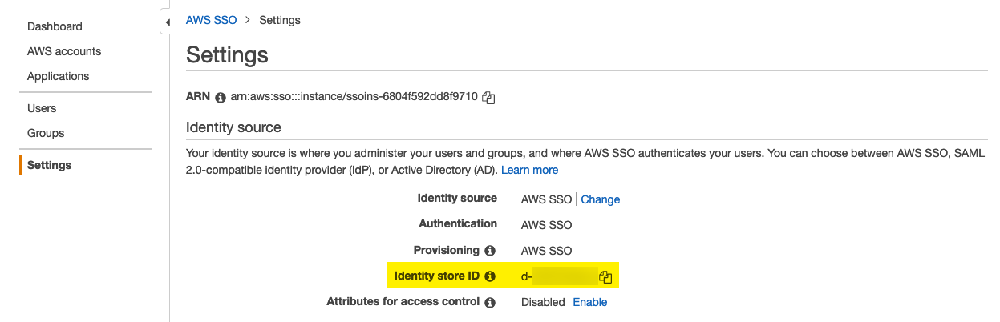

# Setup AWS Single Sign-On (SSO)

## Introduction

AWS Single Sign-On is a cloud-based single sign-on (SSO) service that makes it easy to centrally manage SSO access to all of your AWS accounts and cloud applications.
AWS SSO helps you manage access and permissions to commonly used third-party software as a service (SaaS) applications as well as custom applications that support Security Assertion Markup Language (SAML) 2.0.

## Enable AWS SSO

1. Sign in to the AWS Management Console with your AWS Organizations management account credentials.
2. Open the [AWS SSO console](https://console.aws.amazon.com/singlesignon).
3. Choose Enable AWS SSO.
4. If you have not yet set up AWS Organizations, you will be prompted to create an organization. Choose Create AWS organization to complete this process.

## Choose your identity source

By default, AWS SSO offers its identity source which means users's username and password are directly managed within AWS SSO, however you do have a choice to use an alternate identity source such [Active Directory](https://docs.aws.amazon.com/singlesignon/latest/userguide/manage-your-identity-source-ad.html) or other [external identity provider](https://docs.aws.amazon.com/singlesignon/latest/userguide/manage-your-identity-source-idp.html).

For the purpose of this example we recommend to select the default AWS SSO option to manage identities.

## Add AWS SSO users

Users and groups that you create in your AWS SSO store are available in AWS SSO only. Use the following procedure to add users to your AWS SSO store.

1. Open the [AWS SSO console](https://console.aws.amazon.com/singlesignon).
2. Choose Users.
3. Choose Add user and provide the following required information:
   1. Username – This user name will be required to sign in to the user portal and cannot be changed later.
   2. Password – Choose from one of the following choices to send the user's password.
      * Send an email to the user with password setup instructions – This option automatically sends the user an email addressed from Amazon Web Services. The email invites the user on behalf of your company to access the AWS SSO user portal.
      * Generate a one-time password that you can share with the user – This option provides you with the user portal URL and password details that you can manually send to the user from your email address.
   3. Email address – The value you provide here must be unique.
   4. Confirm email address
   5. First name – You must enter a name here for automatic provisioning to work. For more information, see Automatic provisioning.
   6. Last name – You must enter a name here for automatic provisioning to work.
   7. Display name

4. Choose Next: Groups.
5. Select one or more groups that you want the user to be a member of. Then choose Add user.

## Retrieve Identity store ID

1. Open the [AWS SSO console](https://console.aws.amazon.com/singlesignon).
2. Choose Settings
3. Note the Identity store ID under the Identity source, format is ```d-xxxxxx```



Copyright Amazon.com, Inc. or its affiliates. All Rights Reserved.
SPDX-License-Identifier: MIT-0